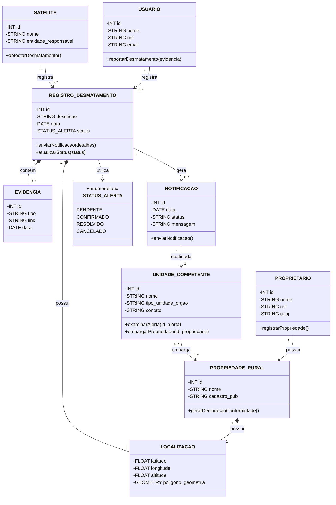

# Sistema de Cadastro Ambiental Rural (sys-car)

## Detalhes

- Instituição:
  - Instituto Federal Sul-Riograndense de Passo Fundo
- Disciplina:
  - Linguagem de Programação Orientada a Objetos - 4° Semestre
- Docente:
  - Leonardo Deliyannis Constantin

## Descrição

- Proprietários poderão registrar suas propriedades rurais, declarando os limites das propriedades sobre um mapa interativo.
- Poderão requisitar declarações de conformidade ambiental, onde será buscado em uma base de alertas de desmatamento se há algum alerta, se não houver, será emitido.
- As propriedades registradas poderão ser embargadas por autoridades competentes se for comprovado desmatamento ilegal

## Integrantes:

- Pedro Henrique Carteli Rossetto
  - Desenvolvedor
  - @pedrohrossetto
- Matheus Pastore Polese
  - Desenvolvedor
  - @MatheusPolese
- Victor Hugo Andreon
  - Desenvolvedor
  - @VictorAndreon
- Eduardo Milani
  - Desenvolvedor
  - @EduardoMilani8

## Diagrama do Modelo Conceitual



## Estrutura do Projeto

O projeto segue o padrão **MVC (Model-View-Controller)** com banco de dados **SQLite**.

```
sys-car/
├── README.md
├── data/                         # (criada automaticamente) banco SQLite
│   └── syscar.db                 # arquivo do banco gerado em tempo de execução
└── src/
    ├── main.py                   # ponto de entrada do programa (menu principal)
    ├── database/
    │   └── database.py           # conexão + criação das tabelas (init_db)
    ├── model/                    # classes POO + operações SQL de cada entidade
    │   ├── proprietario.py       # CRUD do PROPRIETARIO (INSERT/UPDATE/DELETE/SELECT)
    │   └── ...                   # (novas entidades aqui)
    ├── controller/               # regras de negócio e validações
    │   ├── proprietario_controller.py
    │   └── ...                   # (novos controllers aqui)
    └── view/                     # interfaces com o usuário (console)
        ├── proprietario_view.py  # menu CRUD do PROPRIETARIO
        └── ...                   # (novas views aqui)
```

### Como executar

```bash
python3 src/main.py
```

Na primeira execução, o programa cria automaticamente a pasta `data/` e o banco `data/syscar.db`. Se apagar o arquivo do banco, ele será recriado do zero (vazio) na próxima execução.

### Onde fica cada coisa (guia para novos participantes)

| O que você precisa fazer | Onde |
| --- | --- |
| Conectar/criar o banco | `src/database/database.py` |
| **Criar uma tabela nova** | adicionar um `CREATE TABLE IF NOT EXISTS` dentro do `init_db()`, em `src/database/database.py` |
| **Queries de cada CRUD** (INSERT, UPDATE, DELETE, SELECT) | no respectivo arquivo em `src/model/` (ex: `proprietario.py`) |
| Regras de negócio e validações (ex: CPF duplicado) | no respectivo arquivo em `src/controller/` |
| Menus e telas para o usuário | no respectivo arquivo em `src/view/` |
| Expor o menu no programa | registrar no `src/main.py` |

### Padrão para adicionar um novo CRUD

Para cada nova entidade, siga esta ordem dentro de `src`:

1. **model/** → criar a classe POO + as operações SQL (INSERT/UPDATE/DELETE/SELECT)
2. **database/** → adicionar o `CREATE TABLE` da entidade no `init_db()`
3. **controller/** → validar as regras de negócio
4. **view/** → criar o menu console
5. **main.py** → registrar a nova opção no menu principal

> Dica: o `main.py` ajusta o `sys.path` automaticamente, então novos módulos devem ser importados com caminhos relativos à pasta `src` (ex: `from model.proprietario import Proprietario`).

