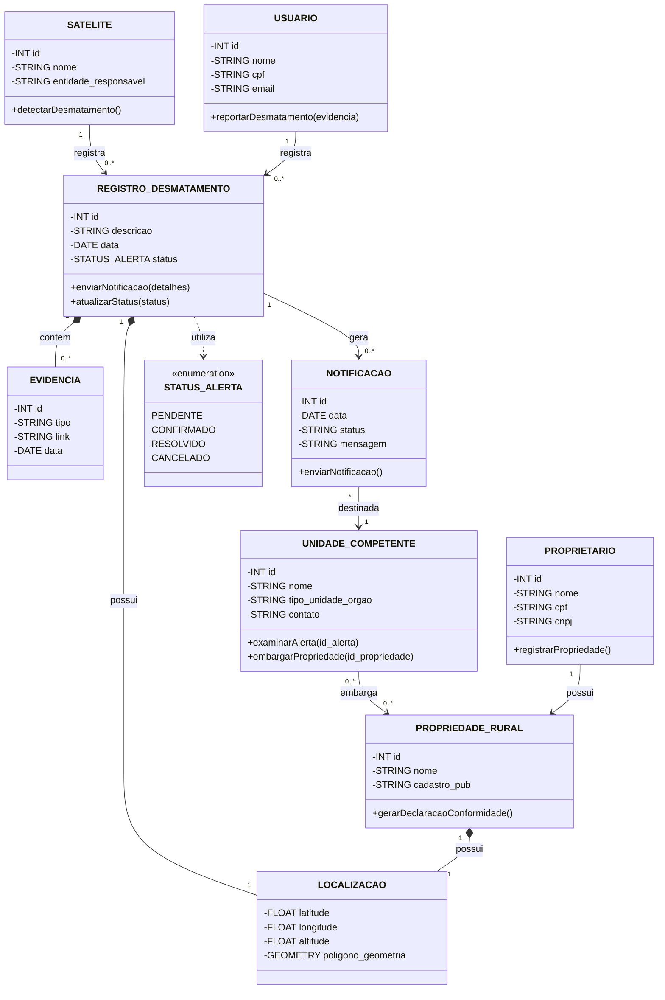

# Sistema de Cadastro Ambiental Rural (sys-car)

## Detalhes

- Instituição:
  - Instituto Federal Sul-Riograndense de Passo Fundo
- Disciplina:
  - Linguagem de Programação Orientada a Objetos - 4° Semestre
- Docente:
  - Leonardo Deliyannis Constantin

## Descrição

- Proprietários poderão registrar suas propriedades rurais, declarando os limites das propriedades sobre um mapa interativo.
- Poderão requisitar declarações de conformidade ambiental, onde será buscado em uma base de alertas de desmatamento se há algum alerta, se não houver, será emitido.
- As propriedades registradas poderão ser embargadas por autoridades competentes se for comprovado desmatamento ilegal

## Integrantes:

- Pedro Henrique Carteli Rossetto
  - Desenvolvedor
  - @pedrohrossetto
- Matheus Pastore Polese
  - Desenvolvedor
  - @MatheusPolese
- Victor Hugo Andreon
  - Desenvolvedor
  - @VictorAndreon
- Eduardo Milani
  - Desenvolvedor
  - @EduardoMilani8

## Diagrama do Modelo Conceitual

