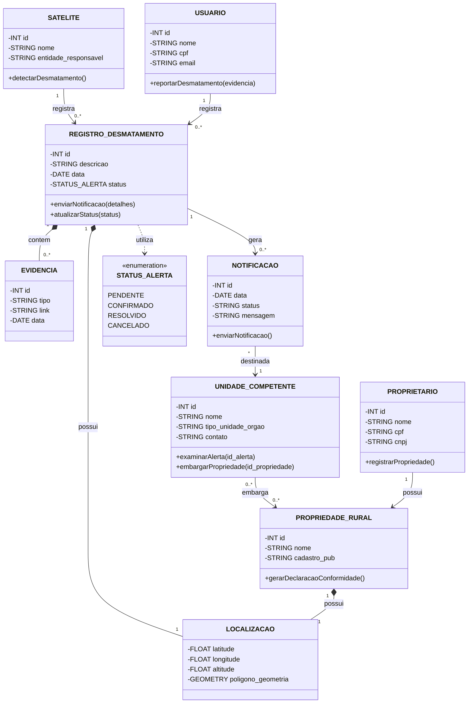
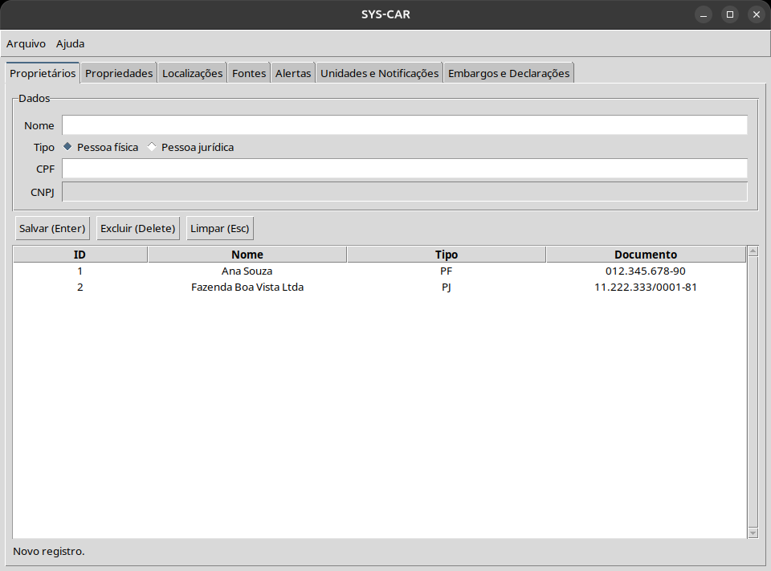
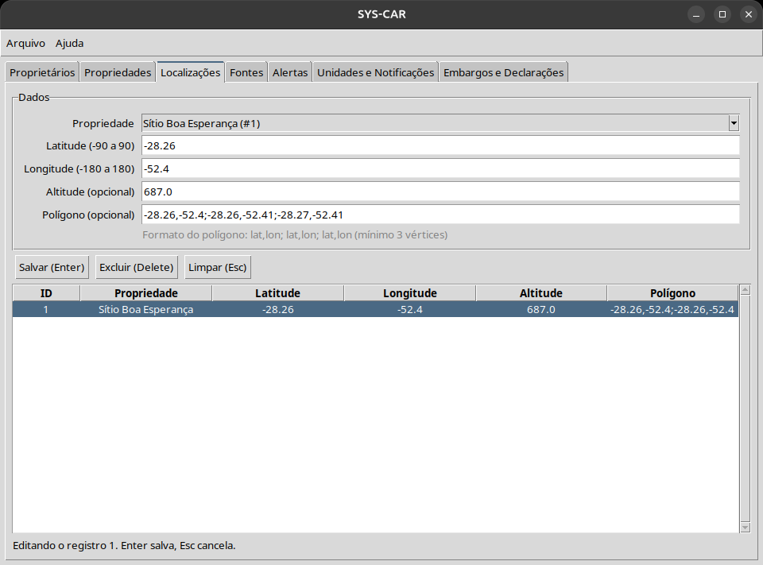

# Sistema de Cadastro Ambiental Rural (sys-car)

## Detalhes

- Instituição:
  - Instituto Federal Sul-Riograndense de Passo Fundo
- Disciplina:
  - Linguagem de Programação Orientada a Objetos - 4° Semestre
- Docente:
  - Leonardo Deliyannis Constantin

## Descrição

- Proprietários poderão registrar suas propriedades rurais, declarando as coordenadas e o polígono que delimita cada propriedade.
- Poderão requisitar declarações de conformidade ambiental, onde será buscado em uma base de alertas de desmatamento se há algum alerta, se não houver, será emitido.
- As propriedades registradas poderão ser embargadas por autoridades competentes se for comprovado desmatamento ilegal

## Integrantes:

- Pedro Henrique Carteli Rossetto
  - Desenvolvedor
  - @pedrohrossetto
- Matheus Pastore Polese
  - Desenvolvedor
  - @MatheusPolese
- Victor Hugo Andreon
  - Desenvolvedor
  - @VictorAndreon
- Eduardo Milani
  - Desenvolvedor
  - @EduardoMilani8

## Diagrama do Modelo Conceitual


```mermaid
classDiagram
direction TB

    class SATELITE {
        -INT id
        -STRING nome
        -STRING entidade_responsavel
        +detectarDesmatamento()
    }

    class USUARIO {
        -INT id
        -STRING nome
        -STRING cpf
        -STRING email
        +reportarDesmatamento(evidencia)
    }

    class REGISTRO_DESMATAMENTO {
        -INT id
        -STRING descricao
        -DATE data
        -STATUS_ALERTA status
        +enviarNotificacao(detalhes)
        +atualizarStatus(status)
    }

    class LOCALIZACAO {
        -FLOAT latitude
        -FLOAT longitude
        -FLOAT altitude
        -GEOMETRY poligono_geometria
    }

    class EVIDENCIA {
        -INT id
        -STRING tipo
        -STRING link
        -DATE data
    }

    class NOTIFICACAO {
        -INT id
        -DATE data
        -STRING status
        -STRING mensagem
        +enviarNotificacao()
    }

    class STATUS_ALERTA {
        <<enumeration>>
        PENDENTE
        CONFIRMADO
        RESOLVIDO
        CANCELADO
    }

    class UNIDADE_COMPETENTE {
        -INT id
        -STRING nome
        -STRING tipo_unidade_orgao
        -STRING contato
        +examinarAlerta(id_alerta)
        +embargarPropriedade(id_propriedade)
    }

    class PROPRIEDADE_RURAL {
        -INT id
        -STRING nome
        -STRING cadastro_pub
        +gerarDeclaracaoConformidade()
    }

    class PROPRIETARIO {
        -INT id
        -STRING nome
        -STRING cpf
        -STRING cnpj
        +registrarPropriedade()
    }

    %% Relacionamentos
    SATELITE "1" --> "0..*" REGISTRO_DESMATAMENTO : registra
    USUARIO "1" --> "0..*" REGISTRO_DESMATAMENTO : registra
    REGISTRO_DESMATAMENTO "1" *-- "1" LOCALIZACAO : possui
    REGISTRO_DESMATAMENTO "1" *-- "0..*" EVIDENCIA : contem
    REGISTRO_DESMATAMENTO "1" --> "0..*" NOTIFICACAO : gera
    REGISTRO_DESMATAMENTO ..> STATUS_ALERTA : utiliza

    NOTIFICACAO "*" --> "1" UNIDADE_COMPETENTE : destinada
    UNIDADE_COMPETENTE "0..*" --> "0..*" PROPRIEDADE_RURAL : embarga

    PROPRIEDADE_RURAL "1" *-- "1" LOCALIZACAO : possui
    PROPRIETARIO "1" --> "1..*" PROPRIEDADE_RURAL : possui
```

O diagrama acima é o modelo **conceitual**. Os diagramas da implementação ficam em [`docs/`](docs/README.md).

## Interface

A janela principal tem uma aba para cada cadastro.





## Documentação

Toda a documentação técnica (decisões de projeto, diagramas UML em pt-BR e EN e guias em Leitura Fácil) está em [`docs/README.md`](docs/README.md).

## Estrutura do Projeto

O projeto segue o padrão **MVC (Model-View-Controller)** com banco de dados **SQLite** e interface **Tkinter**.

```
sys-car/
├── README.md
├── docs/                         # documentação (ADRs, UML, guias)
├── data/                         # (criada automaticamente) banco SQLite
│   └── syscar.db
├── tests/                        # testes automatizados (unittest)
└── src/
    ├── main.py                   # ponto de entrada
    ├── descoberta.py             # descoberta automática de tabelas e abas
    ├── database/
    │   └── database.py           # conexão + init_db() (executa o SCHEMA de cada model)
    ├── model/                    # classes de domínio; cada uma declara seu SCHEMA
    │   ├── base.py               # ModeloBase (Template Method)
    │   ├── documento.py          # validadores de CPF/CNPJ (Strategy)
    │   ├── coordenadas.py        # validação de latitude, longitude e polígono
    │   ├── proprietario.py
    │   ├── propriedade_rural.py
    │   └── localizacao.py
    ├── controller/               # regras de negócio e validações
    └── view/
        ├── janela_principal.py   # janela, menu e descoberta das abas
        ├── aba_crud.py           # AbaCrud (Template Method)
        ├── widgets.py            # Seletor e tabela com rolagem
        └── *_aba.py              # uma aba por entidade
```

### Executar

```bash
python3 src/main.py
```

O programa precisa do **Tkinter**:

- Linux (Debian/Ubuntu): `sudo apt install python3-tk`
- Windows e macOS: o instalador oficial do Python (python.org) já inclui o Tkinter.

Na primeira execução, o programa cria a pasta `data/` e o banco `data/syscar.db`.

> **Banco de uma versão antiga:** se o programa avisar que o banco é de uma versão antiga, apague o arquivo `data/syscar.db` e rode de novo.

### Testes

```bash
python3 -m unittest discover -s tests -v
```

### Como adicionar uma entidade nova

Nenhum arquivo central precisa ser editado:

1. **model/**: crie a classe e declare a constante `SCHEMA` com o `CREATE TABLE IF NOT EXISTS`. O `init_db()` encontra sozinho.
2. **controller/**: crie o controller com as regras. Os métodos de escrita devolvem `(resultado, erro)`.
3. **view/**: crie o módulo da aba com `ORDEM` e `registrar_abas(notebook)`. A janela principal encontra sozinha.
4. **tests/**: crie os testes da entidade.

O acompanhamento do que falta fazer fica nas issues do GitHub.
