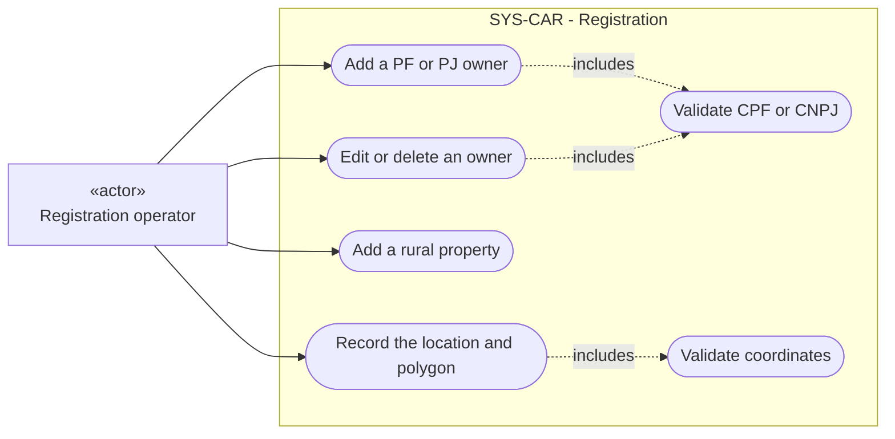
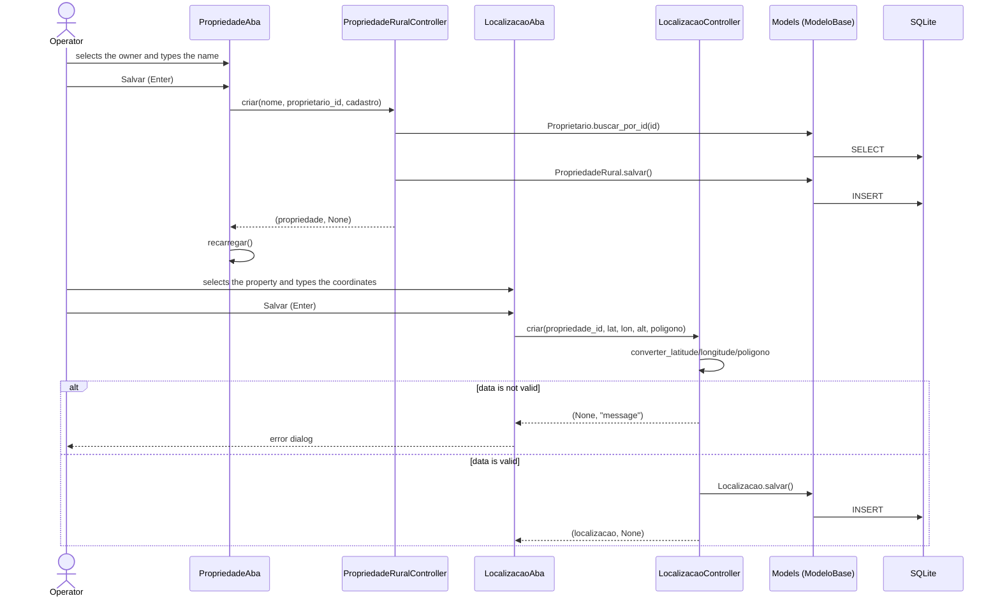
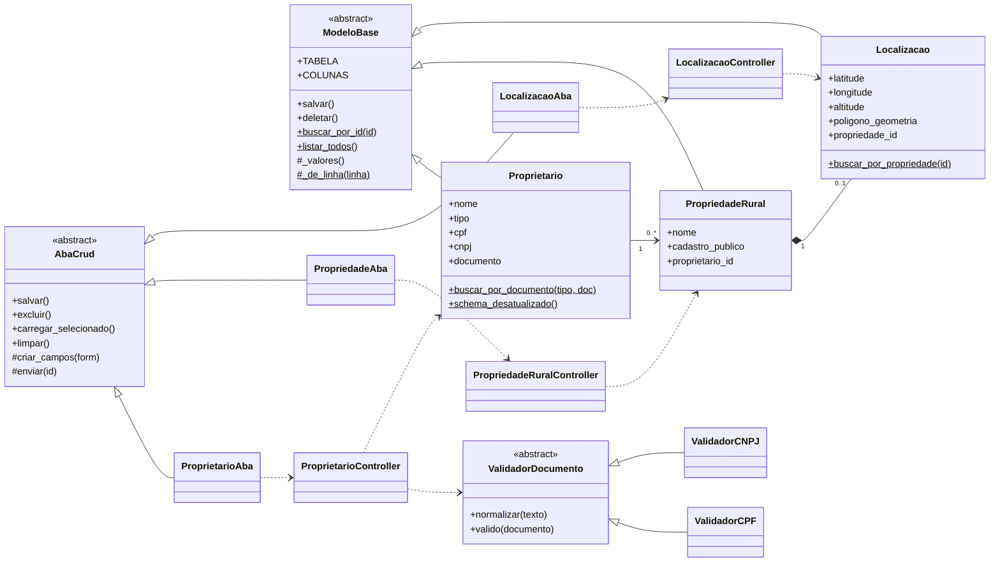
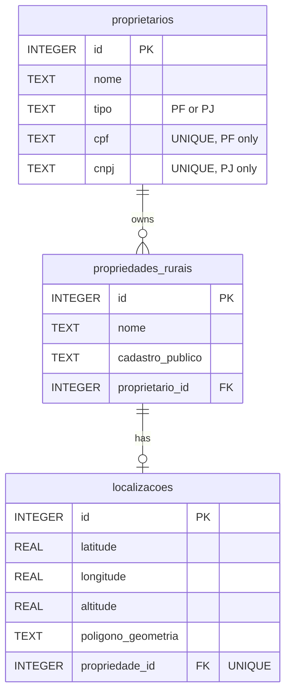

# Registration UML diagrams

## Use cases

Mermaid does not have a native use case diagram. This diagram uses a `flowchart`.
The rectangle is the actor. The round shapes are the use cases.

## Sequence: add a property with its location

## Implementation classes

`ModeloBase` and `AbaCrud` are the Template Method points. `ValidadorDocumento` is the Strategy.

## Data model

When you delete an owner, the system also deletes the properties and their locations (`ON DELETE CASCADE`).

