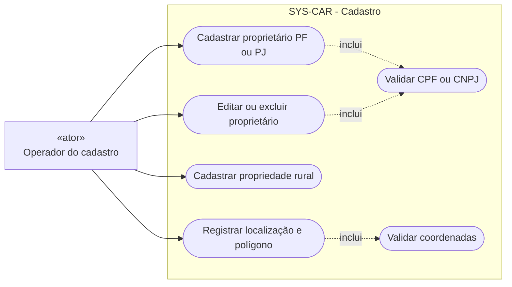
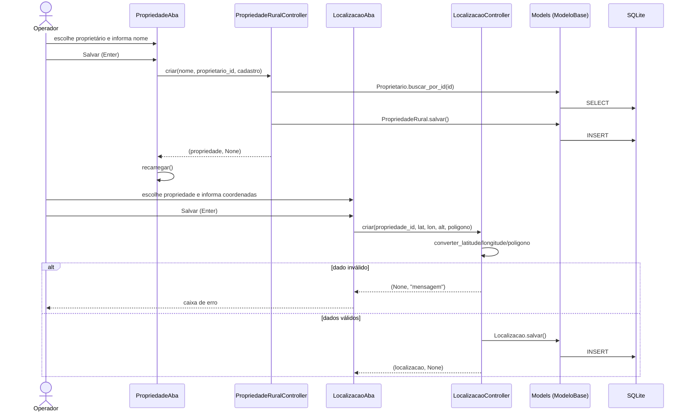
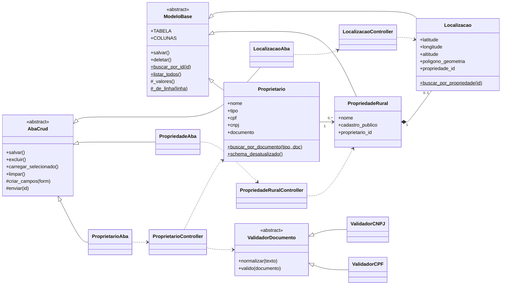
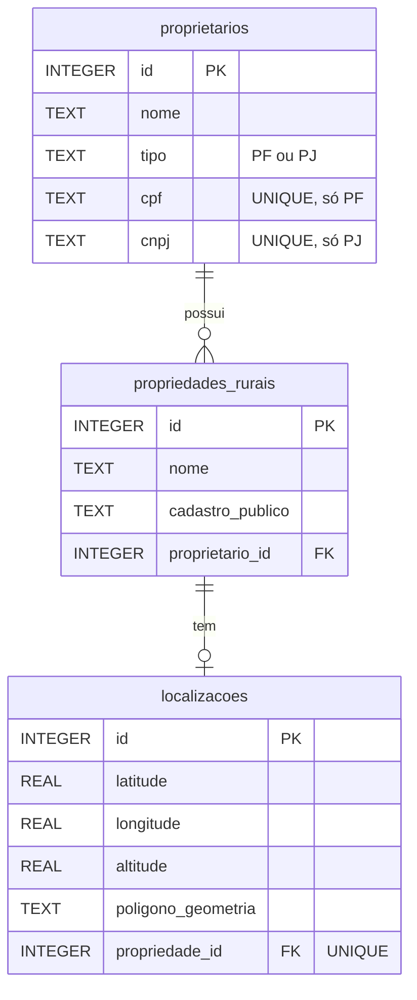

# Diagramas UML do Cadastro

## Casos de uso

O Mermaid não tem diagrama de caso de uso nativo. Este diagrama usa um `flowchart`:
o retângulo é o ator e as formas arredondadas são os casos de uso.

## Sequência: cadastrar propriedade com localização

## Classes da implementação

`ModeloBase` e `AbaCrud` são os pontos de Template Method. `ValidadorDocumento` é a Strategy.

## Modelo de dados

Apagar um proprietário apaga as propriedades dele e as localizações delas (`ON DELETE CASCADE`).

