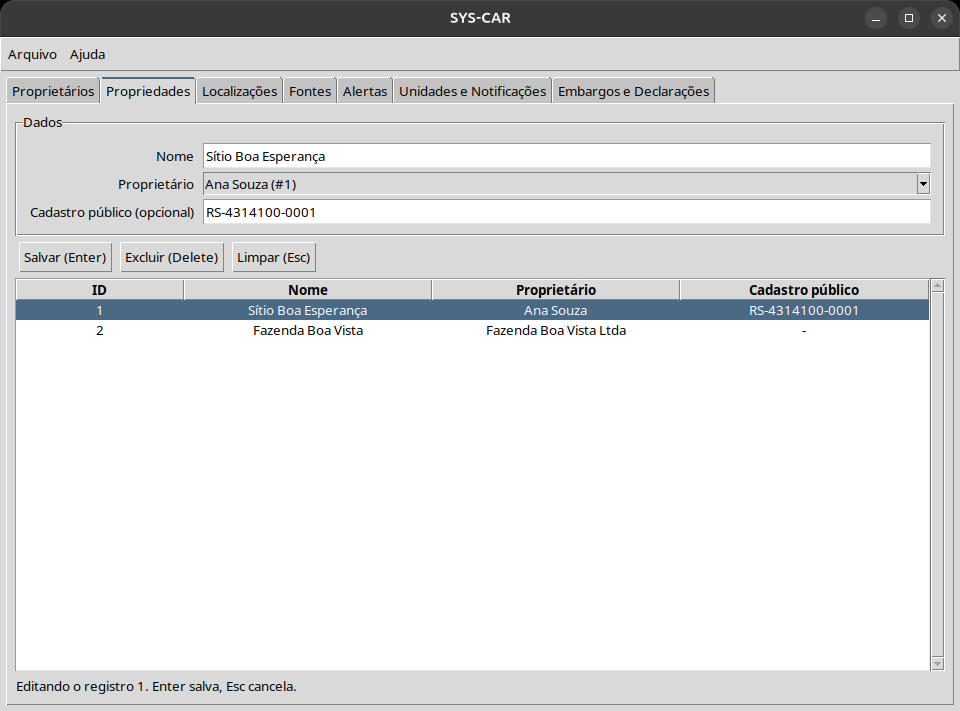

# Como usar o Cadastro do SYS-CAR

Este guia usa frases curtas.
Cada passo tem uma ação.

## O que é o Cadastro

O Cadastro guarda 3 coisas:

- o **proprietário**: a pessoa ou a empresa dona da terra;
- a **propriedade**: a terra, por exemplo um sítio ou uma fazenda;
- a **localização**: o lugar da propriedade no mapa.

## Antes de começar

1. Abra o programa.
2. Veja as abas no alto da janela.
3. Clique na aba que você quer usar.

## Cadastrar um proprietário

1. Clique na aba **Proprietários**.
2. Escreva o nome.
3. Escolha **Pessoa física** ou **Pessoa jurídica**.
4. Pessoa física: escreva o CPF.
5. Pessoa jurídica: escreva o CNPJ.
6. Aperte **Enter** ou clique em **Salvar**.
7. O proprietário aparece na lista.

Se aparecer uma caixa de erro, leia a mensagem.
A mensagem diz o que está errado.
Corrija e salve de novo.

## Cadastrar uma propriedade

1. Clique na aba **Propriedades**.
2. Escreva o nome da propriedade.
3. Escolha o proprietário na lista.
4. Aperte **Enter** ou clique em **Salvar**.

## Cadastrar a localização

1. Clique na aba **Localizações**.
2. Escolha a propriedade na lista.
3. Escreva a latitude. Exemplo: -28,26
4. Escreva a longitude. Exemplo: -52,40
5. A altitude é opcional.
6. O polígono é opcional. Ele marca a borda da terra.
7. Escreva o polígono assim: lat,lon; lat,lon; lat,lon
8. Use 3 pontos ou mais.
9. Aperte **Enter** ou clique em **Salvar**.

Cada propriedade tem só 1 localização.

## Mudar um cadastro

1. Clique 2 vezes na linha da lista.
2. Os dados vão para o formulário.
3. Mude o que precisa.
4. Aperte **Enter**.

## Apagar um cadastro

1. Clique 1 vez na linha da lista.
2. Aperte a tecla **Delete** ou clique em **Excluir**.
3. Confirme.

Cuidado: apagar um proprietário apaga as propriedades dele.

## Limpar o formulário

Aperte **Esc** ou clique em **Limpar**.
