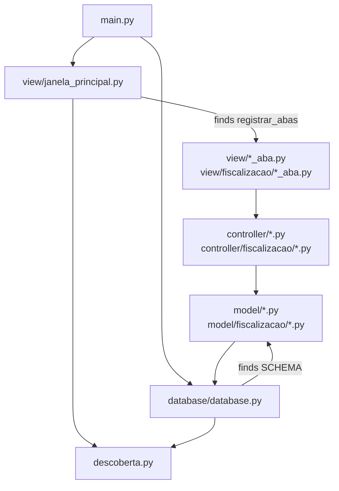

# ADR-001: MVC architecture with a plugin contract

**Status:** accepted

## Context

SYS-CAR has two areas: Registration and Inspection. Two persons develop the two areas at the same time.
The old code kept all tables in `database.py` and all screens in `app_tk.py`.
Each new entity made it necessary to change these two files. This causes merge conflicts.
The old view also called the models directly. This is not correct for MVC.

## Decision

1. The system uses MVC with three layers:
   - **model**: domain classes and access to SQLite.
   - **controller**: business rules and validation. Write methods return `(result, error)`.
   - **view**: Tkinter screens. A view imports only controllers.
2. The layers connect through a **plugin contract** with automatic discovery (`src/descoberta.py`):
   - **Tables**: each module in the `model` package can set `SCHEMA`.
     The function `init_db()` runs each `SCHEMA` that it finds.
   - **Tabs**: each module in the `view` package can set `registrar_abas(notebook)` and `ORDEM`.
     The main window adds the tabs in the sequence of `ORDEM`.
   - The discovery ignores modules with a name that starts with `_`.
3. Registration uses `ORDEM` values from 10 to 49. Inspection uses values from 50 to 99.

## Consequences

- A new entity does not change `database.py`, `main.py` or `janela_principal.py`.
- The two areas use different files. Thus, a merge does not cause conflicts.
- If a discovered module has an import error, the program does not start.
  The error is visible immediately. This is better than a tab that is missing without a message.
- A discovered module must not create widgets or open a connection when Python imports it.

## Package diagram

## Location in the code

- `src/descoberta.py`: `modulos_publicos`, `modulos_com`, `ordenar_por_ordem`.
- `src/database/database.py`: `init_db()`.
- `src/view/janela_principal.py`: `JanelaPrincipal`.
