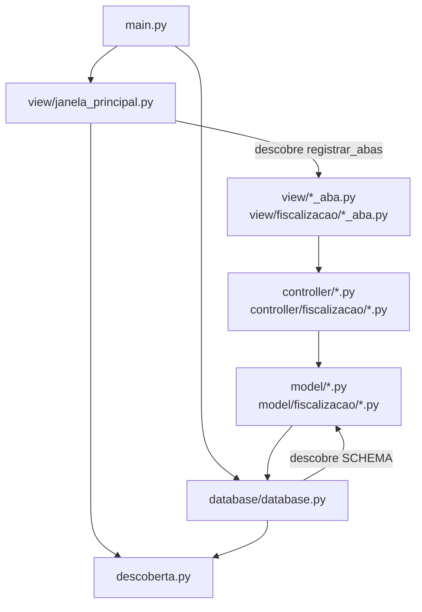

# ADR-001: Arquitetura MVC com contrato de plugin

**Status:** aceita

## Contexto

O SYS-CAR tem duas áreas: Cadastro e Fiscalização. Duas pessoas desenvolvem as áreas ao mesmo tempo.
O código antigo concentrava as tabelas em `database.py` e as telas em `app_tk.py`.
Toda entidade nova obrigava a editar esses dois arquivos. Isso causa conflito de merge.
A view antiga também chamava models diretamente, o que quebra o MVC.

## Decisão

1. O sistema usa MVC em três camadas:
   - **model**: classes de domínio e acesso ao SQLite;
   - **controller**: regras de negócio e validação; os métodos de escrita devolvem `(resultado, erro)`;
   - **view**: telas Tkinter. A view importa só controllers.
2. A integração usa um **contrato de plugin** com descoberta automática (`src/descoberta.py`):
   - **Tabelas**: todo módulo do pacote `model` pode declarar `SCHEMA`.
     O `init_db()` executa todos os `SCHEMA` que encontra.
   - **Abas**: todo módulo do pacote `view` pode declarar `registrar_abas(notebook)` e `ORDEM`.
     A janela principal chama as abas na ordem de `ORDEM`.
   - Módulos com nome iniciado por `_` são ignorados.
3. O Cadastro usa `ORDEM` de 10 a 49. A Fiscalização usa de 50 a 99.

## Consequências

- Uma entidade nova não altera `database.py`, `main.py` nem `janela_principal.py`.
- As duas áreas evoluem em arquivos separados, sem conflito de merge.
- Um erro de importação em um módulo descoberto impede a abertura do programa.
  O erro aparece logo, o que é melhor do que uma aba que some sem aviso.
- Um módulo descoberto não pode criar widgets nem abrir conexão ao ser importado.

## Diagrama de pacotes

## Onde está no código

- `src/descoberta.py`: `modulos_publicos`, `modulos_com`, `ordenar_por_ordem`.
- `src/database/database.py`: `init_db()`.
- `src/view/janela_principal.py`: `JanelaPrincipal`.
