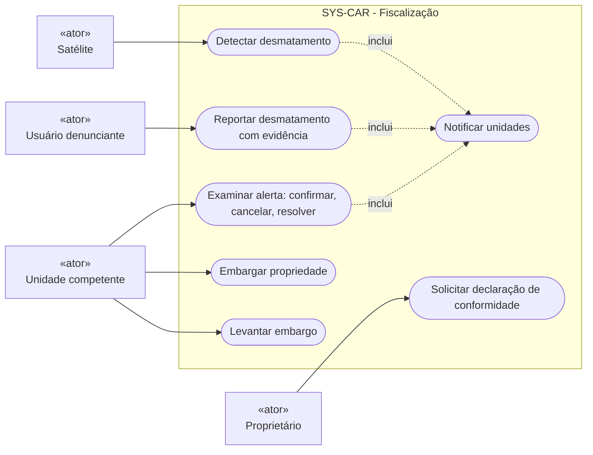
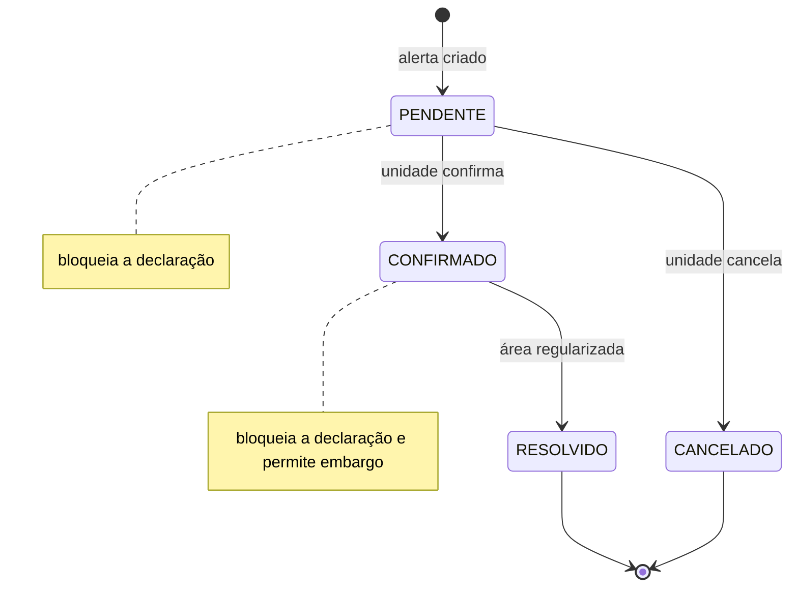
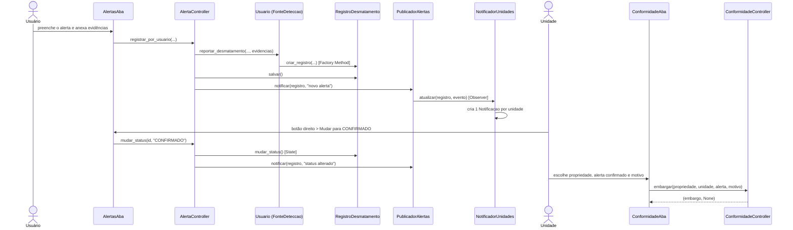
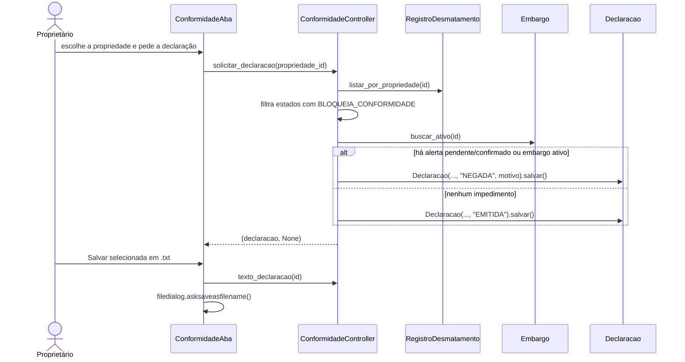
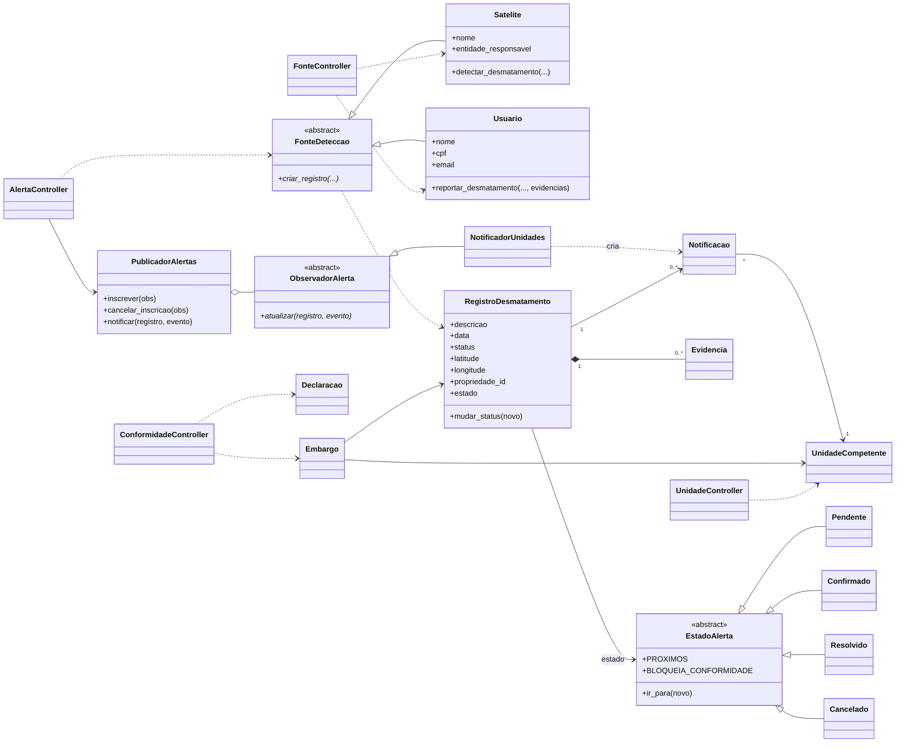
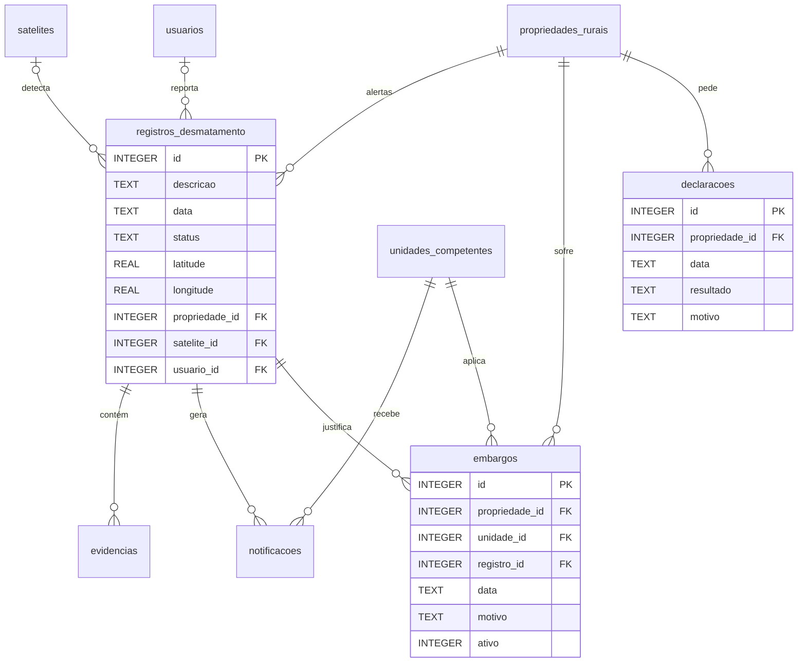

# Diagramas UML da Fiscalização

## Casos de uso

O Mermaid não tem diagrama de caso de uso nativo. Este diagrama usa um `flowchart`:
os retângulos são os atores e as formas arredondadas são os casos de uso.

## Estados do alerta (State)

## Sequência: reportar → notificar → examinar → embargar

## Sequência: pedir declaração de conformidade

## Classes da implementação

`FonteDeteccao` é o Factory Method, `EstadoAlerta` é o State e `ObservadorAlerta`/`PublicadorAlertas` formam o Observer.

## Modelo de dados

Apagar uma propriedade apaga os alertas, as evidências, as notificações, os embargos e as declarações dela (`ON DELETE CASCADE`).
Um índice único parcial garante no máximo um embargo ativo por propriedade.

